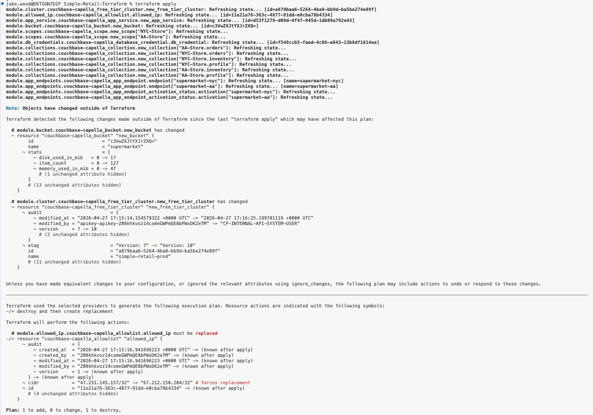

# Simple-Retail-Terraform
Couchbase's simple retail demo application [https://github.com/couchbase-examples/couchbase-lite-retail-demo] introduces you to core Couchbase Mobile concepts and unique advantages:
- Moving data from the edge to the cloud and back again. 
- Enabling one hundred percent availability in the field.

With this demo application you can test out:
- Continuously syncing changes made on iOS or Android to Capella. 
- Syncing changes made locally offline in Couchbase Lite to Capella over App Services when internet connectivity is restored.
- Syncing data between devices using peer to peer sync.

## Repository Objective
Although the required infrastructure for this demo application can be created using the Capella User Interface, the goal of this repository is to show you how to create it in a simple and repeatable way using the Capella Terraform Provider.

Simple to me means:
- Setup in the fewest number of steps.
- Setup in the most logical sequence of steps that are optimized for efficiency.

## Get Started
Head to [https://cloud.couchbase.com/sign-up] and sign up for a free Capella account.
 
If you get stuck, you can refer to this tutorial [https://docs.couchbase.com/cloud/get-started/create-account.html]. 

Once you're signed up, create an Organization called "Simple Retail" and a Project called "simple-retail." 


## Generate Capella Management API Key
Inside of your Simple Retail Organization, click generate key. Double check you are generating a key fron your Organization and not your Project. You should see Organization Owner permissions as an option.


Give the key a name, "simple-retail" and tick Organization Owner for key permissions.

Do not add an allowed IP address and leave access unrestricted by default.

Disable API key expiration for testing. 

Both are not the most secure options but we will destroy the infrastructure at the end.


After generating your key, copy the secret.


Add this secret to auth_token = "{api-secret}" in terraform.tfvars.

Add it to .env as AUTH_TOKEN="{api-secret}" and export AUTH_TOKEN="{api-secret}" in your terminal.

## Use Management API to Fetch IDs
### Fetch Organization ID
Run this curl command in your terminal to return your Organization's ID:

```bash
curl -sS "https://cloudapi.cloud.couchbase.com/v4/organizations" \
  -H "Accept: application/json" \
  -H "Authorization: Bearer $AUTH_TOKEN"
```

Find the returned Organization ID in your terminal.


Update terraform.tfvars with this Organization ID.

### Fetch Project ID
Update the Organization ID below and run this curl command in your terminal to return your Project's ID:

```bash
curl -sS "https://cloudapi.cloud.couchbase.com/v4/organizations/{org_id}/projects" \
  -H "Accept: application/json" \
  -H "Authorization: Bearer $AUTH_TOKEN"
```

Find the returned Project ID in your terminal.


Update terraform.tfvars with your Project ID.

You should now have your Management API Secret, Organization ID and Project ID. With them, you're able to use the Capella Terraform Provider to create the cloud based mobile infrastructure required for this application example.

Any challenges with using the Management API, please refer to the API Guide [https://docs.couchbase.com/cloud/management-api-guide/management-api-intro.html] and API Reference [https://docs.couchbase.com/cloud/management-api-reference/index.html].

## Capella Terraform Provider Prerequisites
Ensure Terraform >= 1.5.2 is installed [https://developer.hashicorp.com/terraform/install].
For Macs, you can install it using Homebrew:

```bash
brew tap hashicorp/tap
brew install hashicorp/tap/terraform
```

Ensure Go >= 1.20 is installed [https://go.dev/doc/install].

For any challenges with the Capella Terraform Provider installation, please refer to the documentation [https://registry.terraform.io/providers/couchbasecloud/couchbase-capella/latest/docs].

Check your installation is successful by running terraform version in your terminal.


## Build Infrastructure With Terraform
In the Simple-Retail-Terraform directory, run:

```bash
terraform init
```


Check the plan before building by running:

```bash
terraform plan
```

You should see 17 resources to add, 0 to change, and 0 to destroy.

After reviewing the plan, you can now run terraform apply to build the infrastructure:

```bash
terraform apply
```

Enter yes to start building.

You will see your Capella cluster deploying in the UI.


You'll see that specific resources depend upon another, you can't create an App Service without a Capella cluster to link it to, and are therefore deployed in a specific order. The steps are clearly visible in your terminal.


The exact deployment time may vary but this example took around 5 minutes.

## Load Demo Data
The JSON data required for this demo is in the demo-dataset directory.

To load data into Capella using the cbimport tool, you'll need database access credentials and your Cluster's connection string.

You can access your database credentials and connection string simply from the terraform outputs.

To get your Cluster's connection string, run:

```bash
terraform output connection_string
```

To get your created Database Credentials, run:

```bash
terraform output -raw db_credential_password
```

Modify the cbimport command with your unique password and connection string. 


You also need an allowed IP to run cbimport because it is not an API call but opens a direct TCP connection to the Couchbase cluster on port 11210 (data) and 18091 (management). The IP allowlist will block all direct connections by default for security.

You can get your public IP by running:

```bash
curl -s https://api.ipify.org
```

Then add /32 at the end to make it a valid CIDR block. 

Update your terraform.tfvars with your public IP address in the allowed_cidr variable.

Run `terraform apply` to ensure the allowlist is up to date (this is required if you changed your IP or are adding it for the first time after the initial build).



Move to the demo-dataset directory and run this command to make the script executable:

```bash
chmod +x cbimport.sh
```

You can then run the script to load all of the required data into the appropriate collections:

```bash
./cbimport.sh
```

You should see confirmation in the terminal that data has imported correctly:


## Create Endpoint Users
With your infrastructure created, you can now head to your Online endpoints to create your App Users.

You will create two App Users, one for each store and therefore in each App Endpoint.

In the supermarket-aa Endpoint, add App User Name: aa-store-01@supermarket.com and password: P@ssword1.

Assign channels by hitting enter for inventory, orders and profile to the identical linked collection.

Your configuration for the AA Store should look like this:


Repeat this for the NYC Store, creating user nyc-store-01@supermarket.com and password: P@ssword1.

Your configuration for the NYC Store should look like this:


## Mobile Emulator
Head to the relevant README at [https://github.com/couchbase-examples/couchbase-lite-retail-demo] for instructions on how to setup the application and run it in your mobile emulator for Xcode or Android Studio.

## Clean Up Infrastructure
Run to destroy all of the infrastructure you've created.
```bash
terraform destroy
```
There is a free tier limitation that requires you to run terraform destroy again to fully remove the infrastructure once the bucket has been deleted.


Capella does destroy the bucket the first time terraform destroy is run, despite the error message.

Run teraform destroy again with the bucket deleted to remove all of the remaining infrastructure.
